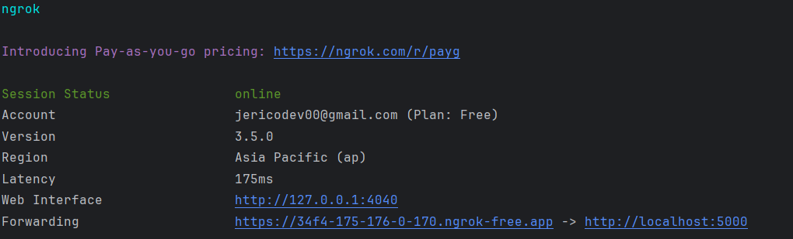

Reference documentation: https://www.kommunicate.io/blog/create-chatbot-in-flask-and-python/

### Notes:
- Need `ngrok` installed
- Currently using a venv with `flask` and python 3.12.1
- Need accounts for Dialogflow (GCP), Ngrok (for auth), and Kommunicate (optional for UI bot testing)

To spice things up, I added some logic to make the chatbot into a simple math solver.

### Process flow:

1. Dialogflow chatbot agent is defined along with the corresponding GCP project
2. Common **Intents** and corresponding **Responses** are defined
    
3. Entities can be added to customize parameters that are taken from the sample intents
    
4. External logic can be added via webhooks. In this case we use **Flask** to create the local logic.
5. From there we can expose the local server to the internet using **Ngrok**. This way we can reference the 
local server as an online url for the dialogflow webhook. 
    
    
6. Once we link these together, we can now send the entities as parameters to our Flask app logic.
7. We now have a working Dialogflow chatbot that can do basic math.
    
8. Lastly we can use Kommunicate to host the chatbot and interact with it directly.
    
9. Note that for this process to work, we need to have two terminals open. One for Flask to setup the local server
, and another for Ngrok to forward that local server into an online URL.