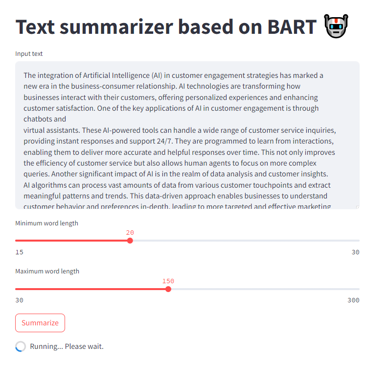
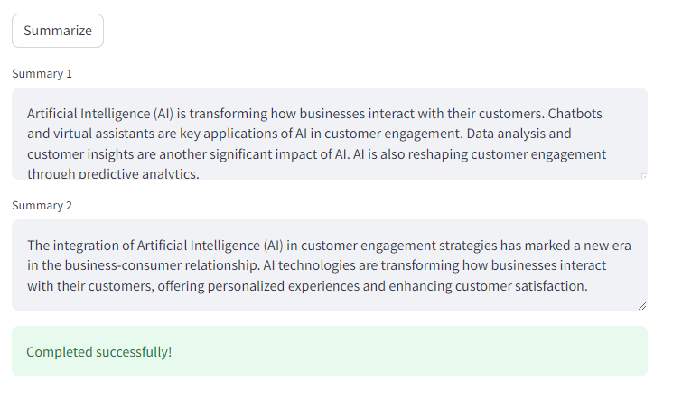

### Reference documentation:
- https://huggingface.co/docs/transformers/model_doc/bart
- https://blog.paperspace.com/bart-model-for-text-summarization-part1/
- https://huggingface.co/learn/nlp-course/chapter7/5?fw=tf

### Notes:

- Found three ways of making use of a pre-trained BART model for text summarization.
  - via pipeline
  - via tokenizer (requires TF and/or PyTorch)
  - via ktrain (though I opted not to use this as it was redundant)
- Several BART summarization models are usable: https://huggingface.co/models?sort=likes&search=bart-large
  - For variety I've chosen two that seem promising:
    - `facebook/bart-large-cnn-samsum`
    - `facebook/bart-large-cnn`
- Streamlit app runnable locally using `streamlit run app.py`
  
  

### Local Testing

```commandline
streamlit run app/app.py
```

### Running app via docker and fastapi def
```commandline
docker build . -t tsmodel --progress=plain &&\
  docker run -p 8501:8501 tsmodel
```
Optional `--progress=plain` to see progress of docker image building

### Dockerized testing:
Open http://127.0.0.1:8501/ or http://localhost:8501/

